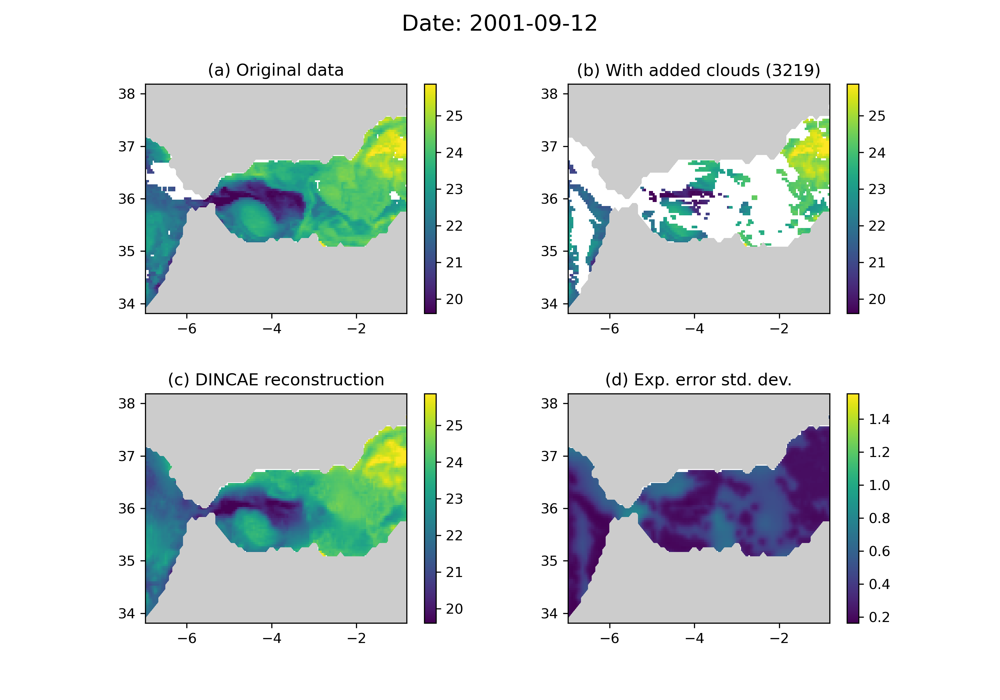

[](https://github.com/gher-uliege/DINCAE.jl/actions)
[](https://codecov.io/github/gher-uliege/DINCAE.jl)
[](https://gher-uliege.github.io/DINCAE.jl/stable/)
[](https://gher-uliege.github.io/DINCAE.jl/dev/)

# DINCAE.jl

DINCAE (Data-Interpolating Convolutional Auto-Encoder) is a neural network to reconstruct missing data in satellite observations.
This repository contains the Julia port of DINCAE. The original [Python code](https://github.com/gher-uliege/DINCAE) is no longer maintained.

Utilities (for plotting and data preparation) are available in a separate repository
https://github.com/gher-uliege/DINCAE_utils.jl

The method is described in the following articles:

* Barth, A., Alvera-Azcárate, A., Licer, M., & Beckers, J.-M. (2020). DINCAE 1.0: a convolutional neural network with error estimates to reconstruct sea surface temperature satellite observations. Geoscientific Model Development, 13(3), 1609–1622. https://doi.org/10.5194/gmd-13-1609-2020
* Barth, A., Alvera-Azcárate, A., Troupin, C., & Beckers, J.-M. (2022). DINCAE 2.0: multivariate convolutional neural network with error estimates to reconstruct sea surface temperature satellite and altimetry observations. Geoscientific Model Development, 15(5), 2183–2196. https://doi.org/10.5194/gmd-15-2183-2022

(click [here](CITATION.bib) for the BibTeX entry).


Panel (a) is the original data where we have added clouds (panel (b)). The reconstuction based on the data in panel (b) is shown in panel (c) together
with its expected standard deviation error (panel (d))

DINCAE is intended to be used with a [GPU](https://en.wikipedia.org/wiki/Graphics_processing_unit) with [CUDA](https://en.wikipedia.org/wiki/CUDA) support (NVIDIA GPU). The code can also run on a [CPU](https://en.wikipedia.org/wiki/Central_processing_unit) but which will be quite slow.

## Installation

You need [Julia](https://julialang.org/downloads) (version 1.9 or later) to run `DINCAE`. The command line interface of Julia is sufficient for `DINCAE`.
If you are using Linux (on a x86_64 CPU), installing and running Julia is as easy as running these shell commands:

```bash
curl -fsSL https://install.julialang.org | sh
```

For more information, other platforms and the current julia version, please see [platform specific instructions](https://julialang.org/downloads/platform/) for further installation instructions.
You can check the latest available version of Julia at https://julialang.org/downloads but avoid beta releases and release candidates if you are new to Julia.

Inside a Julia terminal, you can download and install `DINCAE` and `DINCAE_utils` by issuing these commands:

```julia
using Pkg
Pkg.add(url="https://github.com/gher-uliege/DINCAE.jl", rev="main")
Pkg.add(url="https://github.com/gher-uliege/DINCAE_utils.jl", rev="main")
```

### CUDA support

To enable (optional) CUDA support on NVIDIA GPUs one need to install also the packages `CUDA` and `cuDNN`:

```julia
using Pkg 
Pkg.add("CUDA")
Pkg.add("cuDNN")
```

With some adaptions to `DINCAE.jl`, one can probably also use AMD GPUs (with the package `AMDGPU`) and Apple Silicon (with the package `Metal`). PRs to implement support of these GPUs would be very welcome.

After this, you should be able to load `DINCAE` with:

``` julia
using DINCAE
```

#### Checking CUDA installation

To confirm that `CUDA` is functional to use the GPU (otherwise the CPU is used and the code will be much slower), the following command:
```julia
CUDA.functional()
```
should return `true`.

### Updating DINCAE

To update `DINCAE`, run the following command and restart Julia (or restart the jupyter notebook kernel using `Kernel` -> `Restart`):

```julia
using Pkg
Pkg.update("DINCAE")
```

Note that Julia does not directly delete the previous installed version.
To check if you have the latest version run the following command:

```julia
using Pkg
Pkg.status()
```

The latest version number is available from [here](https://github.com/gher-uliege/DINCAE.jl/releases).

## Documentation

More information is available in the [documentation](https://gher-uliege.github.io/DINCAE.jl/stable/) and the tutorial (available as
[script](https://github.com/gher-uliege/DINCAE.jl/blob/main/examples/DINCAE_tutorial.jl) and [jupyter notebook](https://github.com/gher-uliege/DINCAE.jl/blob/main/examples/DINCAE_tutorial.ipynb)).

## Publications

### About the code
* Barth, A., Alvera-Azcárate, A., Licer, M., & Beckers, J.-M. (2020). DINCAE 1.0: a convolutional neural network with error estimates to reconstruct sea surface temperature satellite observations. Geoscientific Model Development, 13(3), 1609–1622. https://doi.org/10.5194/gmd-13-1609-2020
* Barth, A., Alvera-Azcárate, A., Troupin, C., & Beckers, J.-M. (2022). DINCAE 2.0: multivariate convolutional neural network with error estimates to reconstruct sea surface temperature satellite and altimetry observations. Geoscientific Model Development, 15(5), 2183–2196. https://doi.org/10.5194/gmd-15-2183-2022

### Applications 
* Han, Z., He, Y., Liu, G., & Perrie, W. (2020). Application of DINCAE to Reconstruct the Gaps in Chlorophyll-a Satellite Observations in the South China Sea and West Philippine Sea. Remote Sensing, 12(3), 480. https://doi.org/10.3390/rs12030480
* Ji, C., Zhang, Y., Cheng, Q., & Tsou, J. Y. (2021). Investigating ocean surface responses to typhoons using reconstructed satellite data. International Journal of Applied Earth Observation and Geoinformation, 103, 102474. https://doi.org/10.1016/j.jag.2021.102474
* Jung, S., Yoo, C., & Im, J. (2022). High-Resolution Seamless Daily Sea Surface Temperature Based on Satellite Data Fusion and Machine Learning over Kuroshio Extension. Remote Sensing, 14(3), 575. https://doi.org/10.3390/rs14030575
* Luo, X., Song, J., Guo, J., Fu, Y., Wang, L. & Cai, Y. (2022). Reconstruction of chlorophyll-a satellite data in Bohai and Yellow sea based on DINCAE method International. Journal of Remote Sensing, 43, 3336-3358. https://doi.org/10.1080/01431161.2022.2090872
  
Thank you for citing relevant previous work in DINCAE if you make a scientific publication.
A bibtex entry can be generated from the DOI by using for example `curl -LH "Accept:  application/x-bibtex"  'https://doi.org/10.5194/gmd-15-2183-2022'`.

Feel free to add your publications by making a pull request or opening an [issue](https://github.com/gher-uliege/DINCAE.jl/issues/new/choose).

<!--  LocalWords:  codecov io DINCAE jl Convolutional julia Alvera
 -->
<!--  LocalWords:  Azcárate Licer Beckers convolutional Geosci Dev
 -->
<!--  LocalWords:  Troupin altimetry preprint xzf utils url Knet CUDA
 -->
<!--  LocalWords:  jupyter
 -->
